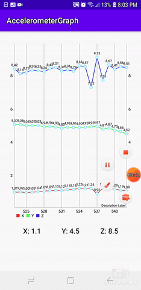

# AccelerometerGraph

A simple application that graphs x,y and z co-ordinates obtained from the Android device's accelerometer in real time.
The graphing tool used is a 3rd party library known as MPCharts maintained by PhilJay

# Click here to use MPCharts 
https://github.com/PhilJay/MPAndroidChart
